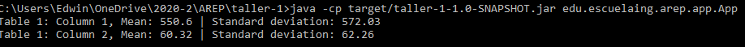

# Arquitecturas empresariales - Taller 1
El objetivo de este programa es calcular la media y la desviación estándar de una lista de números que se leen desde un archivo dentro de los archivos del programa. Para esto se hace uso de una lista doblemente enlazada donde cada nodo contiene el valor.

## Prerequisitos

Conocimientos basicos sobre media y desviación estandar de la muestra de una población, ademas de un lista doblemente encadenada

- Funciones
  - Calculo de la desviacion estandar.
  - Calculo de la media.

## Descarga y instalación

Para clonar este repositorio basta con copiar la siguiente linea en un Shell de cualquier sistema operativo

**“git clone https://github.com/Edyesid/AREP-taller-01.git”**

Es recomendable tener instalado maven en su computadora para poder visualizar de una mejor manera las pruebas y compilación del taller. para esto dirijase al pagina de maven y siga los pasos de instalación.

**https://maven.apache.org/install.html**

Una vez que tenga maven en su computadora, dirijase a la carpeta raiz del taller-1 y para compilar el proyecto se deber introducir el siguiente comando:

**mvn package**

Para poder ejecutar el programa introduce el siguiente comando

**java -cp target/taller-1-1.0-SNAPSHOT.jar edu.escuelaing.arep.app.App**

## Pruebas

## Ejemplos

Se muestran los dos ejemplos que estan en el pdf del taller

## Construido

[Eclipse](https://www.eclipse.org/) plataforma de código abierto para el desarrollo de aplicaciones

## Autor

Edwin Yesid Rodriguez Maldonado

## Licencia

